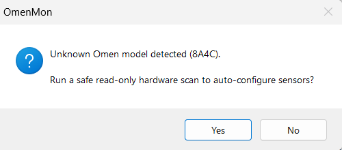
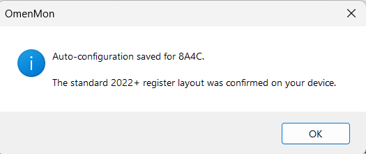

# Auto-Detection

When OmenMon-Reborn starts on a device whose `ProductId` is not present in `Config.Models` (and is not `"?"`), it offers to run a read-only heuristic scan to determine whether the standard 2022+ EC register layout applies.

---

## User flow

### Step 1 — Unknown model prompt

On the first time the main window is shown, a dialog appears:



> *"Unknown Omen model detected (XXXX). Run a safe read-only hardware scan to auto-configure sensors?"*

Clicking **Yes** triggers `AutoDetector.DetectHeuristic(productId)`.  
Clicking **No** dismisses the dialog. The app continues running with `PlatformPreset.Default` as the fallback — fan control will work correctly if the device happens to share the standard register layout, but there is no guarantee.

The prompt fires **once per session** only. It is wired to the form's `Shown` event and unsubscribed immediately after.

---

### Step 2 — Result

**If the scan succeeds:**



> *"Auto-configuration saved for XXXX. The standard 2022+ register layout was confirmed on your device."*

The preset is written to `OmenMon.xml` under `<Models>`. On the next launch, `Platform.InitFans()` finds it in `Config.Models` and the prompt never appears again.

**If the scan fails** (values outside expected ranges), the dialog directs the user to the [Contributing Hardware Data](Contributing-Hardware-Data) tray menu item to file a report with a full EC dump.

---

## How the detection works

`Hardware/AutoDetector.DetectHeuristic()` performs a **full 256-byte read-only EC dump** — no writes to any register at any point. It then checks two invariants:

| Register | Address | Expected range | Rationale |
|----------|---------|----------------|-----------|
| `CPUT` | `0x57` | 20–95 °C | CPU temp is always readable on 2022+ Omen hardware; a value outside this range suggests the address maps to something else |
| `RPM1` (word) | `0xB0`–`0xB1` | 0–7000 rpm | Fan speed is always present, even at idle; values above 7000 indicate the register is not a fan speed |

If both pass, the device receives a copy of `PlatformPreset.Default` under its own `ProductId`. If either fails, `null` is returned.

```csharp
// Hardware/AutoDetector.cs (simplified)
bool cputValid = cput >= 20 && cput <= 95;
bool rpm1Valid = rpm1 >= 0 && rpm1 <= 7000;

if(cputValid && rpm1Valid)
    return new PlatformPreset { ProductId = productId, ... /* Default values */ };

return null;
```

---

## Why read-only matters

The EC is a real microcontroller managing battery charging, thermal throttling, and power rails alongside the fans. Writing to an unknown register can permanently latch a fan off, corrupt a thermal threshold, or trigger a hardware protection mode. The scanner deliberately never writes anything — the worst possible outcome of a failed detection is that the user is shown the "could not detect" message and directed to file a report.

---

## Code location

| File | Relevant method |
|------|----------------|
| `Hardware/AutoDetector.cs` | `DetectHeuristic(string productId)` |
| `App/Gui/GuiFormMain.cs` | `CheckUnknownModel()`, `EventFormShown()` |
| `App/Gui/GuiFormMainInit.cs` | `this.Shown += EventFormShown` |
| `Library/Config.cs` | `SaveModel(PlatformPreset preset)` |
