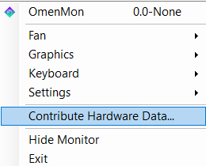
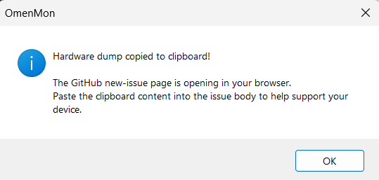

# Contributing Hardware Data

OmenMon-Reborn includes a one-click workflow for users with unsupported devices to submit their hardware data directly as a GitHub issue — without touching the CLI or editing any files.

---

## User flow

### Step 1 — Open the tray menu

Right-click the OmenMon tray icon. The new **"Contribute Hardware Data..."** item appears between the Settings submenu and the main window toggle:

---

### Step 2 — Hardware dump copied

Clicking the item runs the hardware probe immediately (no 5-second wait — single EC snapshot only) and copies the full Markdown output to the clipboard:

> *"Hardware dump copied to clipboard! The GitHub new-issue page is opening in your browser. Paste the clipboard content into the issue body to help support your device."*

At the same time, the OS default browser opens to the GitHub new-issue page. The user pastes the clipboard content into the issue body and submits.

OmenMon itself **never initiates a network connection**. The browser open is handled by `Process.Start(url)` — the HTTP request belongs to the browser, not OmenMon.

---

## What the dump contains

The Markdown report has three sections:

**WMI Baseboard** — Manufacturer, Product ID, Serial, Version. This is the key data for adding a new `<Model>` entry.

**BIOS Capabilities** — Return values for every read-only `BiosCtl` method: fan count, fan type, keyboard type, GPU mode, system data flags, etc. Silently-failing calls (HasOverclock, HasUndervoltBios) are included with a note that `0x00` may indicate unsupported rather than an actual zero value.

**EC Registers — Snapshot 1** — Full 16×16 hex grid of all 256 EC registers at the moment the button was clicked.

> The CLI `-Probe` verb (`OmenMon.exe -Probe`) additionally takes a second snapshot 5 seconds later and appends a delta table of registers that changed — useful for identifying which addresses correspond to temperature sensors and fan speeds under load.

---

## Reviewing a submission

When a user opens an issue with a hardware dump, the relevant fields for adding a `<Model>` entry are:

1. **`Product` from the WMI Baseboard table** — this becomes the `ProductId` attribute.
2. **EC Snapshot** — cross-reference the grid with the [known register addresses](Model-Database#xml-schema) to confirm or identify the correct fan, temperature, and control registers.
3. **`GetFanCount` / `GetFanType` from BIOS** — confirms whether the device has one or two fans and which are CPU/GPU.

Once confirmed, add a `<Model>` block to the default `OmenMon.xml` and open a pull request. See [Model Database](Model-Database) for the schema.

---

## Code location

| File | Relevant method |
|------|----------------|
| `App/Gui/GuiMenu.cs` | `EventActionContribute()` |
| `App/Cli/CliOpProbe.cs` | `ProbeGetMarkdown(bool includeEcDiff)` |
